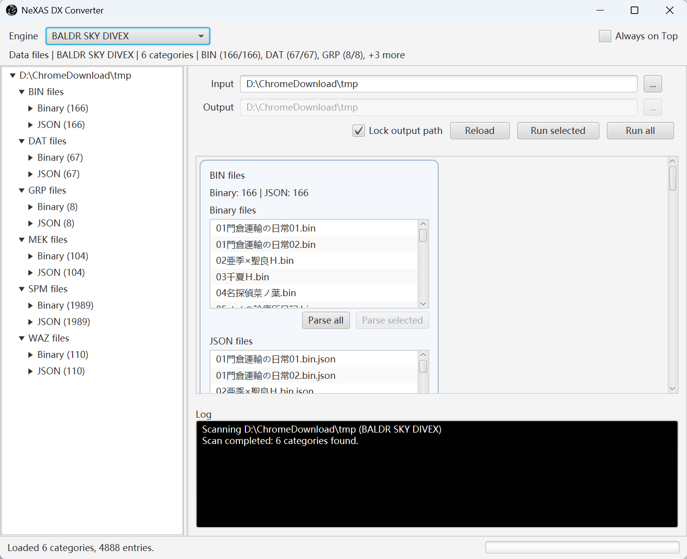

> 首先非常感谢 [kdw-code](https://github.com/kdw-code)，感谢他引领我入门逆向工程、做出的巨大贡献，没他就没有此项目，我也不太可能自己入门逆向，恩情还不完。

# NeXAS_DX

本应用为 JavaFX 桌面应用工具，用于在 NeXAS 引擎（GIGA/戯画）资源与 JSON 之间互转，面向 Mod 制作、格式研究，以及 BHE → BSDX 移植实验。如果你对此感兴趣，就算不懂编程也无所谓，可随时以任何方式联系我。

最终目的是将 bhe 中的角色移植到 bhe 里以供操作游玩，虽然逆向出了文件结构，但因为符号的缺失，并不能完整知道各个属性的真实含义，需要耗费大量时间精力进行测试。

[English](README.md)



## 能做什么
- GUI 选择文件/目录，单个或批量执行解析/回写。
- 针对每种格式的往返测试，保证二进制/JSON 一致性。
- 提供 shaded JAR 以及可选的 Windows 自包含包（`javapackager` 内置 JRE）。
- 附带真实游戏资产用于研究（位于 `src/main/resources/game`，请谨慎处理）。

## 引擎与格式
| 引擎/游戏                  | 解析 | 生成 | 说明 |
|------------------------| --- | --- | --- |
| BSDX (Baldr Sky DiveX) | `.waz` `.mek` `.spm` `.grp` `.bin` `.dat` | 同左 | 覆盖度最高，`.bin` 测试会跳过 `__GLOBAL.bin`。 |
| BHE (Baldr Heart EXE)  | `.waz` `.mek` `.spm` `.grp` | `.spm` `.grp` | 主要用于对照/迁移。 |
| CLARIAS                | `.dat` | `.dat` |  |

## 环境要求
- Windows 10+（JavaFX 依赖使用 `javafx-*-win`）。
- JDK 17（推荐 BellSoft Full JDK），Maven 3.9+。
- 文件统一：UTF-8（无 BOM）+ CRLF。

## 构建
```bash
git clone <repo-url>
cd NeXAS_DX
mvn clean package -DskipTests
```
产物：
- Shaded JAR：`target/NeXAS_DX-1.2.0-FULL.jar`
- 可选 Windows 自包含包（需提供 JDK 路径，内置 JRE）：  
  `mvn clean package -DskipTests -Dpackager.jdk="C:\\Program Files\\BellSoft\\jdk-17"`

## 运行 GUI
- 你可以直接在 release 里获取我打包好的二进制，压缩包里的是面向 Windows 的包，开箱即用
- 自包含包：运行 `target/javapackager/NeXASConverter.exe`。
- Shaded JAR（需将 JavaFX 放入 module path）：
  ```powershell
  set PATH_TO_FX=C:\path\to\javafx-sdk-21\lib
  java --module-path "%PATH_TO_FX%" --add-modules javafx.controls,javafx.fxml,javafx.graphics,javafx.base `
       -jar target/NeXAS_DX-x.x.x-FULL.jar
  ```

## GUI 使用流程
1. 选择工作目录（游戏资源）与可选输出目录。
2. 树/卡片视图按引擎/类型列出文件；双击或点击 **Run selected** 解析 → JSON 或生成 → 二进制。
3. 可按分类或 **Run all** 批量执行，进度/状态会在底部同步。
4. 一定要先备份原始资源，只在副本上实验。

## 测试与流水线
- 跳过测试运行 GUI：`mvn -q -DskipTests compile`，然后 `mvn javafx:run`。
- BSDX `.dat` 三连（顺序不可乱）：  
  1) `mvn "-Dtest=com.giga.nexas.bsdx.TestDat#testGenerateDatJsonFiles" test`  
  2) `mvn "-Dtest=com.giga.nexas.bsdx.TestDat#testGenerateDatFilesByJson" test`  
  3) `mvn "-Dtest=com.giga.nexas.bsdx.TestDat#testDatParseGenerateBinaryConsistency" test`（成功后自动清空 JSON/Generated）  
  如需 CSV 补丁：在第 3 步前先跑 `testToCsv` / `testCsvPatchToJson`。
- BSDX 其它格式：`mvn "-Dtest=com.giga.nexas.bsdx.TestBin#testGenerateBinJsonFiles" test`（`TestGrp/TestMek/TestSpm/TestWaz` 同理），无自动清理。
- BHE ：`mvn "-Dtest=com.giga.nexas.bhe.TestGrp" test` 等，输出目录保留中间文件。
- BHE → BSDX 移植流水线（实验性质）：`mvn "-Dtest=com.giga.nexas.bhe2bsdx.TransferTest#testPipeline" test`，会写入 `src/main/resources/testBhe`，需要完整 grp/mek/waz/spm 集合。

**测试输出目录**位于 `src/main/resources`（如 `datBsdxJson`、`grpBsdxGenerated`），已在 `.gitignore` 中。不需要时请手动清理，避免仓库膨胀。

## 目录速览
- `MainApplication` + `resources/fxml/MainView.fxml`：JavaFX 入口与 UI。
- `controller/*`：文件选择、树/卡片、设置、拖拽、批处理按钮等控制器。
- `service/*BinService` 与 `service/engine/*Adapter`：格式注册与引擎调度。
- `dto/<engine>/<format>`：各引擎/游戏/格式的 DTO 定义，新增格式从这里开始。
- `io/BinaryReader|BinaryWriter`、`util/*`：通用二进制/JSON 辅助与 PAC 工具。
- `transfer/*` 与 `src/test/java/com/giga/nexas/bhe2bsdx`：移植实验脚手架。
- `src/main/resources/game/*`：真实资产，请谨慎使用。

## 约定与易踩点
- JSON/DTO 必须包含 `extensionName`，适配器靠它分派。
- 默认字符集 `windows-31j`，若覆盖需同步更新 `WorkspaceState.charset`。
- 测试均为单线程，勿并行跑多个重 IO 套件，否则输出目录会互相覆盖。
- 部分测试假定路径为 `D:\A\NeXAS_DX`；若路径不同，可改常量或创建同名符号链接。

## 许可
MIT License，详见 `LICENSE`。
